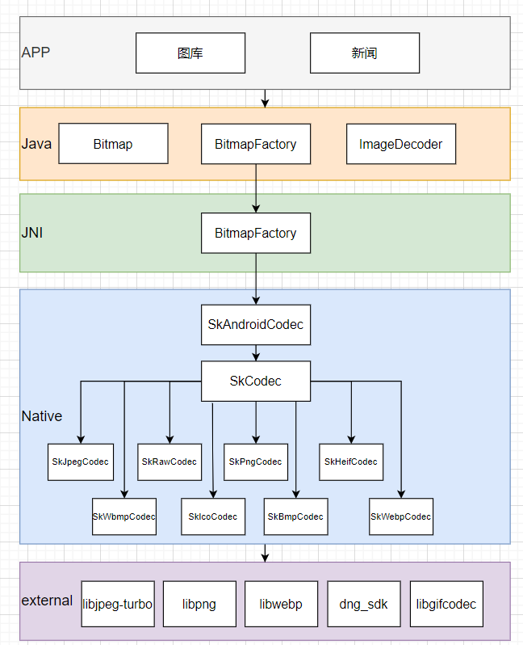

# Android图片解码流程
Android支持的图片有很多种，压缩图，xml图等等。

对于常用的图片来说，主要是这些网络或资源里存在的压缩格式：

- jpeg
- png
- webp
- bmp
- gif
- heif
- ico
- dng

这里主要针对上述图片格式做流程分析，这些压缩图都是有自己的规范的，在解码流程里，这些压缩图会通过规范解压缩得到位图数据，
<!-- more -->

一般针对音视频来说，会使用编码、解码这样的描述，但是对于图片来说，压缩、解压缩也更合适一些，可以从函数的定义（Bitmap.compress），文档的描述中（）看出来。不过对于文章描述来说，遵从大家的口语一致性，解码对应解压缩，编码对应压缩，从语境上理解即可，不必过于纠正词语的规范性。

先贴上一张大图，通览一下整个结构。



## 位图Bitmap

Bitmap即位图的翻译，也是Android中位图类的定义。位图一般是指点阵像素图，位图的数据常用RGB颜色域来表达，这个和视频流常用YUV不同。YUV是视频为了降低码率，适应黑白电视的历史而诞生的，是一种传输过程中的数据流。而RGB是需要在显示端，由显示设备对点阵像素进行渲染绘制的。与RGB对应的还有一种三原色，YCM，这种是减色系，主要用于印刷等行业，其原理是不发光，通过光的反射进行颜色的显示，和RGB正好是反色的。

Bitmap的定义：


## Bitmap解码接口

android上用于获取Bitmap的接口有两类，

- BitmapFactory


- ImageDecoder

两类接口都可以方便的从各种输入流中返回Bitmap。既然都可以，为什么还要搞两套接口呢？
BitmapFactory是API1就存在的接口，简单易用，所有的参数都放在Option中，同时包含有输入输出参数，数量多且不易区分。

ImageDecoder是新引入的接口，这套接口的设计模式偏重于Builder方式，每个不同的参数都需要显式的指定参数.

## skia介绍

skia是一个开源的2D图形渲染框架，因为简单易用，移植性好，所以广泛被使用，被google运用到了多个项目工程里，包括Android，Chromium，Flutter等。

skia除了2D图形之外，还包括了一个小的图片解码框架，这部分就被Android 用来做位图解码之用。但是，google是不甘于做拿来主义的，一方面是要做一些优化，另一方面也要针对Android做一些功能扩展。

skia提供的解码接口使用起来很简单，这样使用：


## 解码流程

BitmapFactory从JNI层开始，引用skia的接口进行处理。原则上，对于Android来说，其实只要合理调用这些接口就行了。

但是实际上，Android不是简单的直接调用的，而在此之外封装了接口，SkAndroidCodec。

可以看到BitmapFactory的JNI代码，逻辑很长。


### SkAdroidCodec

SkAndroidCodec是google基于SkCodec包装的一个类，定义在：

[external/skia/include/codec/SkCodec.h](https://android-opengrok.bangnimang.net/android-12.0.0_r3/xref/external/skia/include/codec/SkCodec.h)

是用于对接JNI层的BitmapFactory，主要扩展了几个接口：

- sampleSize的处理
- dimension的控制

这里面实际包装了一个SkCodec的成员，才是真正包装skia解码接口的地方。

### SkCodec处理流程

SkCodec是skia中定义的用于编解码图片的接口，定义在：

[external/skia/include/codec/SkCodec.h](https://android-opengrok.bangnimang.net/android-12.0.0_r3/xref/external/skia/include/codec/SkCodec.h)

SkStream是对输入数据源的抽象，定义在：

[external/skia/include/core/SkStream.h](https://android-opengrok.bangnimang.net/android-12.0.0_r3/xref/external/skia/include/core/SkStream.h)

#### 接口定义

SkCodec是基类，真正完成解码的是各个实现子类。基类定义了这些接口：

几个关键接口：

- 创建对象：MakeFromStream
- 读取信息：getInfo
- 解码：getPixels

```c++
public:
    static std::unique_ptr<SkCodec> MakeFromStream(
            std::unique_ptr<SkStream>, Result* = nullptr,
            SkPngChunkReader* = nullptr,
            SelectionPolicy selectionPolicy = SelectionPolicy::kPreferStillImage);
    /**
     *  Return a reasonable SkImageInfo to decode into.
     *
     *  If the image has an ICC profile that does not map to an SkColorSpace,
     *  the returned SkImageInfo will use SRGB.
     */
    SkImageInfo getInfo() const { return fEncodedInfo.makeImageInfo(); }

    SkISize dimensions() const { return {fEncodedInfo.width(), fEncodedInfo.height()}; }

    /**
     * Return the ICC profile of the encoded data.
     */
    const skcms_ICCProfile* getICCProfile() const

    /**
     *  Return a size that approximately supports the desired scale factor.
     *  The codec may not be able to scale efficiently to the exact scale
     *  factor requested, so return a size that approximates that scale.
     *  The returned value is the codec's suggestion for the closest valid
     *  scale that it can natively support
     */
    SkISize getScaledDimensions(float desiredScale) const
     
     /**
     *  Return (via desiredSubset) a subset which can decoded from this codec,
     *  or false if this codec cannot decode subsets or anything similar to
     *  desiredSubset.
     *
     *  @param desiredSubset In/out parameter. As input, a desired subset of
     *      the original bounds (as specified by getInfo). If true is returned,
     *      desiredSubset may have been modified to a subset which is
     *      supported. Although a particular change may have been made to
     *      desiredSubset to create something supported, it is possible other
     *      changes could result in a valid subset.
     *      If false is returned, desiredSubset's value is undefined.
     *  @return true if this codec supports decoding desiredSubset (as
     *      returned, potentially modified)
     */
    bool getValidSubset(SkIRect* desiredSubset) const
      
     /**
     *  Format of the encoded data.
     */
    SkEncodedImageFormat getEncodedFormat() const { return this->onGetEncodedFormat(); }

    /**
     *  Decode into the given pixels, a block of memory of size at
     *  least (info.fHeight - 1) * rowBytes + (info.fWidth *
     *  bytesPerPixel)
     *
     *  Repeated calls to this function should give the same results,
     *  allowing the PixelRef to be immutable.
     *
     *  @param info A description of the format (config, size)
     *         expected by the caller.  This can simply be identical
     *         to the info returned by getInfo().
     *
     *         This contract also allows the caller to specify
     *         different output-configs, which the implementation can
     *         decide to support or not.
     *
     *         A size that does not match getInfo() implies a request
     *         to scale. If the generator cannot perform this scale,
     *         it will return kInvalidScale.
     *
     *         If the info contains a non-null SkColorSpace, the codec
     *         will perform the appropriate color space transformation.
     *
     *         If the caller passes in the SkColorSpace that maps to the
     *         ICC profile reported by getICCProfile(), the color space
     *         transformation is a no-op.
     *
     *         If the caller passes a null SkColorSpace, no color space
     *         transformation will be done.
     *
     *  If a scanline decode is in progress, scanline mode will end, 
     *  requiring the client to call
     *  startScanlineDecode() in order to return to decoding scanlines.
     *
     *  @return Result kSuccess, or another value explaining the type of failure.
     */
    Result getPixels(const SkImageInfo& info, void* pixels, size_t rowBytes, const Options*);

    /**
     *  Simplified version of getPixels() that uses the default Options.
     */
    Result getPixels(const SkImageInfo& info, void* pixels, size_t rowBytes) {
        return this->getPixels(info, pixels, rowBytes, nullptr);
    }

    Result getPixels(const SkPixmap& pm, const Options* opts = nullptr) {
        return this->getPixels(pm.info(), pm.writable_addr(), pm.rowBytes(), opts);
    }
```

根据第一张图可以发现，实际有7个完成具体工作的子类。

#### 插件注册

skia里使用了插件的方式，注册了各种格式类型的图片的插件，用于不同格式的解码。

这个插件的定义简单有效，是值得学习的，是两个函数指针，然后各个插件实现，只要返回一个SkCodec对象就可以了。

```c++
struct DecoderProc {
    bool (*IsFormat)(const void*, size_t);
    std::unique_ptr<SkCodec> (*MakeFromStream)(std::unique_ptr<SkStream>, SkCodec::Result*);
};
```

以下是注册的函数，skia支持注册自己实现的类或者说插件进行解码：

```c++
    // Register a decoder at runtime by passing two function pointers:
    //    - peek() to return true if the span of bytes appears to be your encoded format;
    //    - make() to attempt to create an SkCodec from the given stream.
    // Not thread safe.
    static void Register(
            bool                     (*peek)(const void*, size_t),
            std::unique_ptr<SkCodec> (*make)(std::unique_ptr<SkStream>, SkCodec::Result*));
```

skia框架里默认实现了常见的各种图片格式的注册，一般都是用这些默认的：

```c++
static std::vector<DecoderProc>* decoders() {
    static auto* decoders = new std::vector<DecoderProc> {
    #ifdef SK_CODEC_DECODES_JPEG
        { SkJpegCodec::IsJpeg, SkJpegCodec::MakeFromStream },
    #endif
    #ifdef SK_CODEC_DECODES_WEBP
        { SkWebpCodec::IsWebp, SkWebpCodec::MakeFromStream },
    #endif
    #ifdef SK_HAS_WUFFS_LIBRARY
        { SkWuffsCodec_IsFormat, SkWuffsCodec_MakeFromStream },
    #elif defined(SK_USE_LIBGIFCODEC)
        { SkGifCodec::IsGif, SkGifCodec::MakeFromStream },
    #endif
    #ifdef SK_CODEC_DECODES_PNG
        { SkIcoCodec::IsIco, SkIcoCodec::MakeFromStream },
    #endif
        { SkBmpCodec::IsBmp, SkBmpCodec::MakeFromStream },
        { SkWbmpCodec::IsWbmp, SkWbmpCodec::MakeFromStream },
    };
    return decoders;
}
```

以jpeg为例，可以具体看下，每个插件怎么识别类型的：

jpeg文件开头是固定的0xFF, 0xD8, 0xFF：

```c++
bool SkJpegCodec::IsJpeg(const void* buffer, size_t bytesRead) {
    constexpr uint8_t jpegSig[] = { 0xFF, 0xD8, 0xFF };
    return bytesRead >= 3 && !memcmp(buffer, jpegSig, sizeof(jpegSig));
}
```


#### 插件调用

实际使用的时候，就是遍历所有的decoders，根据peek的结果检查是否是对应的格式：

```c++
    // PNG is special, since we want to be able to supply an SkPngChunkReader.
    // But this code follows the same pattern as the loop.
#ifdef SK_CODEC_DECODES_PNG
    if (SkPngCodec::IsPng(buffer, bytesRead)) {
        return SkPngCodec::MakeFromStream(std::move(stream), outResult, chunkReader);
    } else
#endif
    {
        for (DecoderProc proc : *decoders()) {
            if (proc.IsFormat(buffer, bytesRead)) {
                return proc.MakeFromStream(std::move(stream), outResult);
            }
        }

#ifdef SK_HAS_HEIF_LIBRARY
        SkEncodedImageFormat format;
        if (SkHeifCodec::IsSupported(buffer, bytesRead, &format)) {
            return SkHeifCodec::MakeFromStream(std::move(stream), selectionPolicy,
                    format, outResult);
        }
#endif

#ifdef SK_CODEC_DECODES_RAW
        // Try to treat the input as RAW if all the other checks failed.
        return SkRawCodec::MakeFromStream(std::move(stream), outResult);
#endif
    }
```

但是skia这里其实做了各种适配，PNG，RAW，HEIF等都是打乱了原来的架构设计，说明实际世界变化太快，代码设计跟不上了，原来都是静态图，对于包含视频帧的图（HEIF，AVIF）是没有预料到的，导致原来的识别方式无法满足了，还要返回一个format用于区分是HEIF还是AVIF。

### 解码返回

对于位图来说，解码得到的就是位图pixels数据buffer，和配套的Info信息，包含了大小、format等。对于数据来说，不需要拷贝返回（也不可能，数据太大了，浪费资源），做地址指针的记录就行；而配套信息，需要包装成java层的对象予以返回。