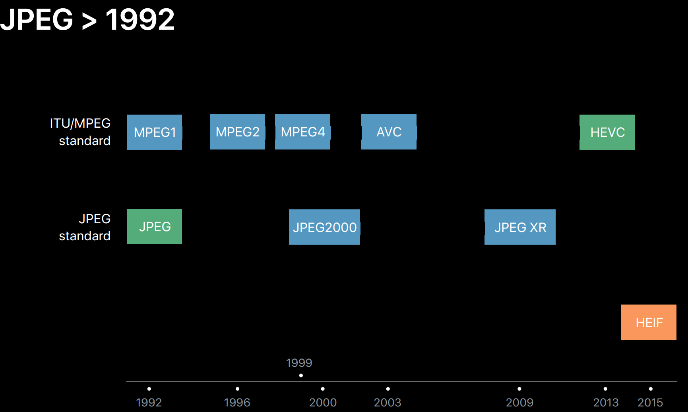

# 什么是HEIF格式
HEIF格式的全名为[高效率图像格式（High Efficiency Image Format ，HEIF）](https://en.wikipedia.org/wiki/High_Efficiency_Image_File_Format), 是一种图像容器格式，它所生成的图像文件相对较小，且图像质量也高于较早的 JPEG 标准，基于高效视频压缩格式（也称为 HEVC 或 H.265）是由动态图像专家组（MPEG）在2013年推出的新格式，参见 https://nokiatech.github.io/heif/.
<!--more-->

它定义了封装格式，编码格式，以及图像的展示方式，甚至涉及到与用户如何交互；所以一套完整的HEIF解决方案，一定是平台相关的，不只包含了拆包封包，还包括了编解码，展示，这些都需要与平台整合。

**TODO**
为什么这里会是nokia公司的介绍作为HEIF的主要参考？Nokia是当时支持HEIF的主要参与者。

可以看下HEIF和JPG路标图：

# HEIF 特性
## Heif 特性
从nokia的官网可以看到这些描述：

HEIF files can store:
- Still Images, their thumbnails and related metadata such as EXIF or XMP information
- Image Collections, their thumbnails and related metadata such as EXIF or XMP information
- Image sequences such as cinemagraphs or image bursts and related metadata
- Unprocessed image and processed images in the same file with proper labelling and referencing
- Image derivation information such as rotation, overlay and grid view along with the images, so that different image derivations can make use of the same image data set
- Auxiliary image data such as depth map and alpha channel along with the images
- Audio tracks and cover images along with still images and image sequences
- Well-defined information about content context to signal e.g. stereo pairs, time-synchronized capture, image bursts and image album groups

HEIF files also inherit many properties of ISOBMFF such as edit lists, media alternatives, media data groupings. Moreover, an MP4 file can be “branded” so that it can also contain images and image sequences as well as video and audio (i.e. dual branding)

| type | description |
| ----------| ------------ |
|静态图|包含缩略图和metadata|
|图像集合|包含缩略图和metadata|
|图像序列|电影图像和图片连拍，以及metadata|
|混合图片|包含处理的和未处理的图在一个文件里|
|图片派生信息|如旋转、叠加和网格视图|
|辅助图像数据|如深度图，alpha图|
|音轨数据和封面图|静态图和图像序列中可以包含这些信息|
|图像信息上下文|如立体图像，时间同步，图片连拍，图像组|

nokia的库提供了如下支持：
|HEIF|static|grid|sequence|overlay|identiy|audio|
|---|---|---|---|---|---|---|
|Display|---|---|---|---|---|---|
|Demux|yes|yes|yes|yes|yes|yes|
|Mux|yes|yes|yes|yes|yes|yes|
|Decode|---|---|---|---|---|---|
|Encode|---|---|---|---|---|---|
|Camera|---|---|---|---|---|---|

## 格式对比
和其他格式对比情况：

![]https://image-static.segmentfault.com/100/619/1006199941-5b6bf1645c226

# HEIF支持情况
1. 以下这些描述来自2017年，苹果刚发布支持HEIF

苹果在iOS11系统中引入HEIF格式用于替代原来的JPG格式的图片。使用HEVC的编码技术存储图像数据，进一步减少存储容量和提升图像质量。 据WWDC17数据，使用HEIF会达到JPEG压缩比的2倍。使用iOS11系统的iPhone手机，在相机的设置中格式选择高效，拍摄下来的照片会保存为HEIF格式。

由于目前其他系统(Windows/Android)还不支持该格式图片的显示，所以在将iPhone中的照片导入到Windows PC时，iOS系统会将其转码为JPG格式图片。目前只有macOS High Sierra版本的mac系统支持HEIF格式图片，在将iPhone中的图片导入到该系统的mac上时可以保持原有的格式（一般后缀名为.heic，表示图像的编码格式为HEVC格式）。
iOS设备通过AirDrop发给其他iOS设备时，如果接收方为iOS 10及以下OS版本时，发送方也会将heif图片转码成JPG格式发送。

2. 厂商支持情况

最早被苹果公司的 iPhone 所使用，并且也在 Google 的 Android P 手机系统开始支持。微软也于 Windows 10 Build 17123 预览版开始，新增了对 HEIF 图像格式的系统原生支持。

iOS：
|HEIF|static|grid|sequence|overlay|identiy|audio|
|---|---|---|---|---|---|---|
|Display|yes|---|---|---|---|---|
|Demux|yes|yes|yes|yes|yes|yes|
|Mux|yes|---|---|---|---|---|
|Decode|yes|yes|yes|yes|yes|yes|
|Encode|yes|yes|yes|yes|yes|yes|
|Camera|---|---|---|---|---|---|

Android：
|HEIF|static|grid|sequence|overlay|identiy|audio|
|---|---|---|---|---|---|---|
|Display|yes|---|---|---|---|---|
|Demux|yes|yes|---|yes|yes|yes|
|Mux|yes|---|---|---|---|---|
|Decode|yes|yes|yes|yes|yes|yes|
|Encode|yes|yes|yes|yes|yes|yes|
|Camera|---|---|---|---|---|---|

3. web端支持情况

nokia的展示页面可以看到HEIF demo的图片，是基于Nokia自己的解码库完成。对于浏览器来说，很多新版本的浏览器已经支持。

# HEIF获取
1. 设备拍照
   
通过上面的描述，其实可以看到，如果你手头有支持HEIF的设备，如iOS 11以后的设备，或者Android P以后的设备（需要厂商支持），就可以用设备拍一张照片就可以得到了。

2. 网络下载

当然，也可以从网络端下载，最简单的就是从Nokia官网。

在gh-pages分支下存储了网页上展示的heif原始资源图片：
https://github.com/nokiatech/heif/tree/gh-pages/content

以及更多的一些heif测试资源，包含了基本码流和配置文件：
https://github.com/nokiatech/heif_conformance

3. 工具转换

使用Nokia的库自己转换制作heif图片：
https://github.com/nokiatech/heif  
支持C++、JAVA API，可以在windows，Android平台方便移植使用。
如何使用可以参考：http://jpgtoheif.com/

# HEIF 解析

## HEIF解析工具
虽然系统有照片等工具可以直接展示HEIF，但是还是有很大局限性的。从Nokia上下载的各种heic图，在windows上的默认照片工具不是全都支持，而且对于开发而言，需要深入解析到每张图具体的格式内容。

金山云基于QT开发了一款在MAC上的查看工具，和MP4Info类似，通过QT编译后，也可以在windows上运行：https://github.com/ksvc/MediaParser

其实最好的是基于Nokia的库实现解析，支持规格比较完整。

## 格式解析
以下内容部分参考：https://www.jianshu.com/p/b016d10a087d  
以下内容部分参考：https://zhuanlan.zhihu.com/p/35847861

### ISO BMFF
HEIF格式是基于 ISO Base Media File Format格式衍生出来的图像封装格式，所以它的文件格式同样符合ISO Base Media File Format (ISO/IEC 14496-12)中的定义（ ISOBMFF）。

规范文档可以参考：https://www.iso.org/standard/74428.html

文件中所有的数据都存储在称为Box的数据块结构中，每个文件由若干个Box组成，每个Box有自己的类型和长度。在一个Box中还可以包含子Box，最终由一系列的Box组成完整的文件内容，结构如下图所示，图中每个方块即代表一个Box。常见的MP4文件同样是ISOBMFF结构，所以HEIF文件结构和MP4文件结构基本一致，只是用到的Box类型有区别。

HEIF文件如果是单幅的静态图片的话，使用item的形式保存数据，所有item单独解码；如果保存的为图片序列的话，使用trak的方式保存，这种trak的形式同mp4的audio、video track类似， 每个轨道存储一张图片。

**ISOBMFF格式说明**

### 各个box说明
heif的格式遵从上面的描述，但是有自己的扩展。
以具体的照片为例，它的最外一层由ftyp、meta和mdat三个Box组成，然后meta Box由包含有多个子Box，如图： 

1. ftyp

FileType Box在文件中有且仅有一个，它的类型字段值为ftyp，位于文件起始位置，其中的brand定义了文件中所存放的媒体类型，它的定义为：

在heif图片中，会扩展major_brand类型：
|brand|coding format|image or sequence|MIME subtype|File Extension|
|---|---|---|---|---|
|heic|HEVC Main or Main Still Picture profile|image|heic|.heic|
|heix|HEVC Main 10 |image|heic|.heic|
|hevc|HEVC Main or Main Still Picture profile|sequence|heic-sequence|.heic|
|hevx|HEVC Main 10|sequence|heic-sequence|.heic|

2. mdat

media data box的类型为mdat，它用来存储实际图片数据.

3. meta

不同于视频文件中的moov box，heif中的数据放在meta box中。

meta box为一个container box，它里面包含有多个子box，各个子box一起定义了图像数据的位置格式等信息。

- hdlr：HandlerBox，指明该meta信息描述的媒体类型，此处为pict
- dinf：在此处无用
- pitm：PrimaryItemBox，文件中会保存有多个item，使用该box指明要主item
- iinf：ItemInfoBox，该box中指明文件中共有多少个item，并包含有子box表明每个item的信息
- iref：ItemReferenceBox，该box包含有多个子box，每个子box指明一组相互有关联的item
- iprp：ItemPropertiesBox，它有ipco和ipma两个子box

*ipco* box列出了所有item的所有属性

*ipma* box中指明每个item都有哪些属性

如下图所示，ipco box列出了color、hvcC、ispe、irot、pixi等信，ipma中指明了item和属性之间的关联 
id为1-48的item统一和3、1、2三个属性关联，分别是ispe、clor和hvcC，其中hvcC类型的box中数据体部分为HevcDecoderConfigurationRecord结构的数据，从中可以获取SPS、PPS、VPS等编码参数相关数据 
id为49的item拥有4、5、6三个属性 
id为50的item拥有7、8、9、5、10几个属性 

- idat：ItemDataBox，item的数据除了保存在mdat中，还可以保存在idat box中，具体会保存在什么位置，由iloc box中指明
- iloc：ItemLocationBox，该box指明了每个item在文件中的保存位置
如果某个item的method字段为0，表示该item的数据保存在mdat box中，且此处指明保存位置的offset字段值为在整个文件中的偏移量， 
如果item的method字段为1，表明该item的数据保存在上面说的idat box中。 

### Still Image 静态图
heif单张图片是item形式存储，可以使用工具来查看其中的信息。

### ImageCollection 多图

### ImageBurst 连拍

### ImageSequence 动图

### Image Derivations 图片派生信息

### Auxiliary Image Storage 图片辅助数据
   
### 包含用户描述信息的图片

## 解析实现
1. 基于Android平台

基于Android平台接口和能力，实现了一个简单的转换demo，参考：https://github.com/ccfriend/HeifDemo
Android提供的接口HeifWriter只能支持静态的图片生成。

2. 基于nokia的库做转换

基于nokia的库使用有一个参考，可以基于FFMPEG先生成hevc码流，然后通过json文件生成最终的heic文件。http://jpgtoheif.com/

3. 基于开源的libheif

有个开源的libheif库用于支持heif和avif的解析：https://github.com/strukturag/libheif

可以使用在线版进行heif的验证：https://strukturag.github.io/libheif/

4. GIMP支持

同上，同样这个厂商支持了libheif在GIMP中的插件实现：https://github.com/strukturag/heif-gimp-plugin

这个是新的GIMP版本直接支持的： 
Note: this plugin is part of GIMP v2.10.2 (or Windows v2.10.4 binaries). You only need to manually install this plugin if you are running a lower version of GIMP.

5. ffmpeg的支持

# Android平台实现完整支持
从上面描述看，目前完整支持HEIF的全价值功能，还是有不少工作量的。包括：
1. 图片解码
2. 各种heif特性的解析，目前看是都有
3. hevc的编解码支持，目前看可以使用硬解，配合软解
4. 解码后显示，目前只有静态图，缺失较多，是扩展ImageView，GifMovie，等等
5. 图片编码，目前也只有静态图，且heiwriter 包支持，非SDK支持
6. 转码，在效率不高的情况下，需要先解图为Bitmap，然后压缩YUV，最后生成
7. 相机通路，拍照支持
