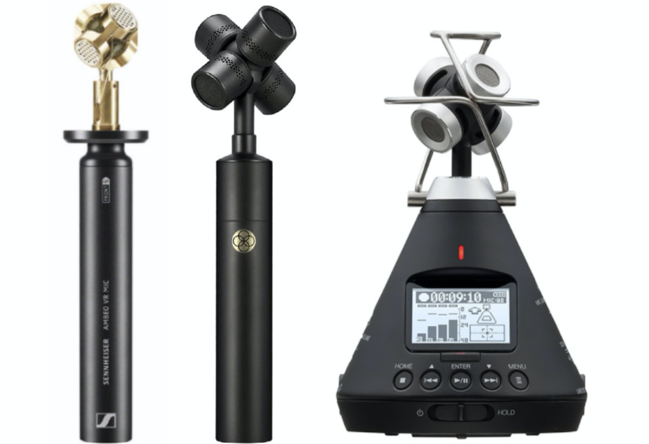

总结音频使用到的相关技术，分为如下几个部分：

- 音频技术概述
- 音频技术领域
- 音频技术实践
- 技术展望

<!-- more -->

# 概述

## 音频技术链路

### 声学

以下内容参考：

[什么是声学？ - 知乎 (zhihu.com)](https://zhuanlan.zhihu.com/p/104660783)

[What is Acoustics (byu.edu)](https://acoustics.byu.edu/what-is)

声学被定义为处理声音的产生，控制，传输，接收和效果的科学（如Merriam-Webster所定义）。

声音的范围：

翻译过后的“声学之轮”，涉及的领域和学科非常广泛。

### 关注领域

结合上面的分解，对于我们而言，涉及到的主要是这几个方向：

**音频信号处理（Audio signal processing）**：涉及范围比较广，比如

- 模拟声音信号处理，涉及到电气工程；
- 声音增强，比如在混响比较强的空间中；
- 去噪，比如Skype的回声消除或者助听器的去噪降噪；
- 音频文件压缩，比如MP3；
- 声音信号识别，比如摇一摇搜歌。

**电声学（Electroacoustics）**：涉及到耳机、麦克风、音响等声音系统的声音重建和录制的设计。随着手机等便携式电子设备的兴起而迅猛发展，HiFi爱好者对其也有很大推动。相关的电子企业都有电声方面的研究。

**音乐声学（Musical Acoustics）**：致力于研究音乐的物理特性和感知。主要包括乐器和电子合成器的功能和设计，人类的嗓音研究，电脑分析音乐和合成（原来有个同事在芬兰学的computational music），医用的音乐理疗等等。

**噪声控制（Noise Control）**：顾名思义，关注怎样降低噪声，可从三个领域降噪：噪声源、传播途径和接受者（比如戴耳塞）。噪声控制里面包含一个重要的工业应用分支：NVH（noise, vibration, and harshness），在汽车领域扮演者极为重要的角色。继N和V之后，H也逐渐被重视起来，这就不得不谈心理声学。

**语音（Speech）**：包括语音的产生、处理和感知，涉及到物理、生理、心理、语音信号处理和语言学。在人工智能/机器学习中，语音识别和语义分析是两大重要课题。如何让语音清晰、高效、高质量的被传递和接受是现在语音交互中的难点。

个人觉得，可以结合互联网和芯片领域再加上，

**音频芯片**：Codec和DSP设计，嵌入式蓝牙、WiFi等音频芯片

**音频制作、传输和分发**：互联网行业常见的方式

**结构音频**：各种设备上关于音频发声的结构声学设计

## 音频行业

- SDK和集成解决方案：

  [声网](https://www.agora.io/cn/about-us)

- SoC芯片：

  [Qualcomm-美国高通公司官方网站](https://www.qualcomm.cn/)

  [MediaTek | Homepage](https://www.mediatek.com/)   

- 芯片制造：

  [智能穿戴芯片_TWS耳机芯片_智能音频SoC_炬芯科技官网_炬芯科技 (actions-semi.com)](https://actions-semi.com/)

- 音频制作和分发：

  [QQ音乐-千万正版音乐海量无损曲库新歌热歌天天畅听的高品质音乐平台！](https://y.qq.com/)

  [有声小说,相声,评书,故事,儿歌,在线听书 - 喜马拉雅 (ximalaya.com)](https://www.ximalaya.com/)

  [有声小说-有声读物-电台广播在线听书-蜻蜓FM (qingting.fm)](https://www.qingting.fm/)

- 音频算法：

  [Nuance - Conversational AI for Healthcare and Customer Engagement | Nuance](https://www.nuance.com/index.html)

  [科大讯飞 - 用人工智能建设美好世界 (iflytek.com)](https://www.iflytek.com/index.html)

- 音频效果：

  [杜比 - Dolby](https://www.dolby.com/zh-cn/)

- 家庭影院：

  https://www.sonos.com/zh-cn/home

# 音频技术领域

## 音频基础

### 声音要素

以下内容参考：https://blog.csdn.net/daxiangwusheng/article/details/116161987

#### 声波简介

- 声波是一种纵波。
- 声音必须在介质中传播，无论是固体、液体还是气体，都可以作为介质。
- 声音在固体中的传播速度最快，其次是液体，声音在气体中传播的速度最慢。

#### 声波基本量

- f：频率，每秒钟振动的次数，单位Hz(赫兹）频率高的声音称为高音，频率低的声音称为低音；人耳对声波频率的主观感觉范围为20Hz~20kHz；低于20Hz为次声波，高于20kHz为超声波。
- λ：波长，在传播途径上，两相邻同相位质点距离。单位m(米)。声波完成一次振动所走的距离。
- C：声速，声波在某一介质中1秒钟传播的距离。单位m/s。（声速受温度的影响）

#### 声音三要素

- 响度：又称声强或音量，它表示的是声音能量的强弱程度，主要取决于声波振幅的大小。正常人听觉的强度范围为0dB—140dB。

  单位为Sone 宋，用S表示，定义为1kHz，声压级为40db SPL纯银的响度为1宋。

- 音高：又称音调 pitch，表示人耳对声音调子高低的主观感受。客观上音高大小主要取决于声波基频的高低，频率高则音调高，反之则低，单位用赫兹(Hz)表示。

  Pitch (Mels) = 1127loge(1 + f / 700)

  基频，2次谐波，3次谐波，感知到基频分量。

  八度？

- 音色：又称音品，由声音波形的谐波频谱和包络决定。声音波形的基频所产生的听得最清楚的音称为基音，各次谐波的微小振动所产生的声音称泛音。单一频率的音称为纯音，具有谐波的音称为复音。

### 语音信号

人用来说话和听觉的集合。

#### 语音产生

人声产生的原理，发声器官分为三部分：

1， 呼吸器官，肺，气管和支气管

2，喉头和声带，喉部提供激励源，声带振动产生声音

3，口腔、咽腔、鼻腔构成声道，发音的共鸣器，对声音进行调制。

#### 语音的发声模型

#### 语音波形和语谱

#### 清音和浊音

#### 语音的基音、谐波、频谱包络

#### 语音感知

耳朵

### 数字音频基础

#### PCM

参考：https://helpx.adobe.com/cn/audition/using/digitizing-audio.html

https://time.geekbang.org/column/article/447712

在自然界中，声音是连续不断的，是一种模拟信号，但是计算机和我们的芯片都是在数字领域来处理的，我们就需要数字化，即转换为数字信号。声音是一种波，有自己的振幅和频率，那么要保存声音，就要保存声音在各个时间点上的振幅。
而数字信号并不能连续保存所有时间点的振幅，事实上，并不需要保存连续的信号，就可以还原到人耳可接受的声
音。根据奈奎斯特采样定理：为了不失真地恢复模拟信号，采样频率应该不小于模拟信号频谱中最高频率的2倍。
根据以上分析，PCM的采集步骤分为以下步骤：

模拟信号 -> 采样 -> 量化 -> 编码 -> 数字信号

- 采样

采样率表示音频信号每秒的数字快照数。该速率决定了音频文件的频率范围。采样率越高，数字波形的形状越接近原始模拟波形。低采样率会限制可录制的频率范围，这可导致录音表现原始声音的效果不佳。

两个采样率：A. 使原始声波扭曲的低采样率。 B. 完全重现原始声波的高采样率。 

为了重现给定频率，采样率必须至少是该频率的两倍。例如，CD 的采样率为每秒 44,100 个采样，因此可重现最高为 22,050 Hz 的频率，此频率刚好超过人类的听力极限 20,000 Hz。

- 量化

为了用正确的数字表达第个采样的声音高低大小，科学家们也想了很多办法，简单点地思考，如果能听到的声音只有三种：高音、中音和低音，我们只要用三个数字表示有无高中低音就可以准确地量化了，这样只要有三位的[二进制](https://www.zhihu.com/search?q=二进制&search_source=Entity&hybrid_search_source=Entity&hybrid_search_extra={"sourceType"%3A"answer"%2C"sourceId"%3A687848321})就可以表示了。实际上CD的采样用了65536长的二进制来表示，也就是16位的一个数字表示每个采样的声音。

采样声波时，为每个采样指定最接近原始声波振幅的振幅值。较高的位深度可提供更多可能的振幅值，产生更大的动态范围、更低的噪声基准和更高的保真度。

- 编码

最后就是编码了。由于数字信号是由0，1组成的，因此，需要将幅度值转换为一系列0和1进行存储，也就是编码，
最后得到的数据就是数字信号：一串0和1组成的数据。

综合在一起就是：

#### 声道

声道代表了两个独立的轨道，用于存储不同的声音，比如LR左右声道，可以分别传输两路音频，当然两路音频是可以有关联的，代表了不同的声音数据内容。

平时买音响和耳机的时候听过 2.1 声道或者 5.1 声道等名词，这些数字代表了有多少个播放单元。比如，2.1 声道中的 2 指的是左右两个音箱，1 指的是中间一个低音音箱。每个音箱都会播放一个单独的音频，这时候就需要同时有 3 路音频信号同时播放，或者叫通道数为 3。

由于编 / 解码器能力的限制（比如使用了单通道编 / 解码器），或者采集设备能力的限制（只能采集单通道的信号），音频信号通常为单声道的。听歌的时候，戴上耳机如果听到左右耳朵是不一样的，能够感觉到声音是从不同方向传过来的，那么就说明这个音频是双声道。我们通常也把这种双声道音频叫做立体声（Stereo）。除了播放需要多声道以外，采集也可能采集到多通道的数据。比如麦克风阵列采集到的原始信号，有多少个麦克风就会有多少个通道的音频信号。因此，这里通道数的物理含义其实就是同一时间采集或播放的音频信号的总数。

双声道的pcm文件存储方式：

#### 码率

码率代表了声音的数据量，以48K，16bit，2ch为例，计算的码率，每秒的数据量为：

比特带宽/码率 = 采样位深×采样率×通道数 = 48000 * 16 * 2 = 1536000bps =1500Kbps = 1.46Mbps

#### 音频质量评价

参考：[04｜如何评价音频质量的好与坏？ (geekbang.org)](https://time.geekbang.org/column/article/459470)

音频的评价方法主要有两种。

一种是主观评价，即组织足够数量的人来听被测音频样本，并给每个被测样本打分，最后根据测试人打分的高低来评判音频质量的好坏。主观测试是音频评价的黄金准则，这样的评价是最符合人的实际听感的。但是主观评测费时费力，在算法迭代、研发等中间过程中不一定是最经济的方案。

另一种测试方法是客观测试，即通过数学方式计算出一些音频质量评价所需要的指标，比如信噪比（SNR）、频谱差异等。然后综合这些指标去拟合一个主观分数。这样就可以通过数学计算而不是人来给出一个音频质量的评价。但无论是主观测试还是客观测试，都需要遵守一套严格的测试评价标准，来保证音频质量评价的准确性。

##### 主观评测

MUSHRA（Multi-Stimulus Test with Hidden Reference and Anchor，多激励隐藏参考基准测试方法）属于 ITU-R BS.1534 中的推荐测试方法。它最早被用于流媒体与通信的相关编码的主观评价，现在也被广泛应用于心理声学相关研究中的音质主观评价。其测试的特点主要是在测试语料中混入无损音源作为参考（上限），全损音源作为锚点（下限），通过双盲听测试，对待测音源和隐藏参考音源与锚点进行主观评分。

所谓“双盲”就是测试人和提供测试的人都不知道自己要听的是哪段语料，这个在测试环节中很重要。比如，如果你提前告诉测试人“你的算法会让声音中的风声不那么刺耳”之类的暗示，或者在测试的时候双号为无损语料，单号为测试语料，这样的操作都会让测试结果不具有参考性。

为了方便人们测试使用，GitＨub 上有基于Ｗeb 版的[MUSHRA](https://github.com/audiolabs/webMUSHRA) 自动打分工具，可以自行下载使用。

除了 MUSHRA，在 ITU 中还有其它一些针对不同场景的音频测评标准，比如 ITU-T 评价标准中的 ITU-T P.800《语音质量的主观评价方法》，也就是我们常说的 MOS（Mean Option Scores，平均意见分），以及 ITU-T P.830《电话和宽带数字语音编码器的主观评价方法》、ITU-T P.805《对话质量的主观评价》等。

##### 客观评测

- 有参考音频质量评价

在 2001 年，ITU-T P.862 标准定义了有参考客观评价算法 PESQ（Perceptual Evaluation of Speech Quality，语音质量感知评价），该算法主要用来评估窄带（8kHz 采样率）及宽带（16kHz 采样率）下的编解码损伤。该算法在过去的二十年中，被广泛的应用于通信质量的评定。

随着技术的发展，PESQ 的应用范围变得越来越窄，于是在 2011 年，P.863 标准定义了一套更全面、更准确的有参考客观评价算法 POLQA。相比 PESQ，POLQA 可评估的带宽更广，对噪声信号和延时的鲁棒性更好，其语音质量评分也更接近于主观的评分。

PESQ 算法已经开源，而 POLQA 你需要购买一套专门的设备和授权才能使用。所以目前做一些日常的测试中，PESQ 还是用的比较多的方法。

- 无参考音频质量评价

不需要参考信号，仅通过对输入信号本身或参数的分析即可得到一个质量评分。比较著名的无参考客观评价方法有 ITU-T P.563、ANIQUE+、E-model、ITU-T P.1201 等。在ACQUA等实验设备中有集成。

### MIDI

在音乐世界里，还有一种专门针对音乐的编码格式。

MIDI全称是Musical Instrument Digital Interface顾名思义是一种音乐乐器的记录格式。以钢琴为例，MIDI文件记录了时间序列中每个钢琴音的起止位置、按键力度等信息。很显然光有MIDI文件你是听不到声音的还需要有一个记录了乐器各种音的音调的音源库配套使用，比如文件记录在第3秒要弹一个C4的音，然后就去音源库把C4的音源按时间拼接上去，最后依次把所有的乐器音都拼接起来就成了可播放的音频文件。起初各大厂商MIDI文件格式都不太统一。直到后来MIDI1.0标准的发布各家厂商遍都遵循了相同的标准。现在已经发展到MIDI2.0了。

### 音乐信号处理

[03｜如何分析与处理音乐信号？ (geekbang.org)](https://time.geekbang.org/column/article/452960)

## 音频编解码

根据上面码率的计算，可以看到常规的音频大约需要1M的带宽，目前看起来不大，但是技术在进步。

一方面，多声道，高采样的音频越来越多，另一方面，无线传输和实时音频的诉求越来越强，音频编码技术也同视频编码一样，属于必需品。

常见的音频编码格式，一般分为无损和有损两类。

### MP3

### AAC

AAC是高级音频编码（Advanced Audio Coding）的缩写，出现于1997年，最初是基于MPEG-2的音频编码技术。由Fraunhofer IIS、Dolby Laboratories、AT&T、Sony等公司共同开发，目的是取代MP3格式。2000年，MPEG-4标准出台，AAC重新集成了其它技术（PS,SBR），为区别于传统的MPEG-2 AAC，故含有SBR或PS特性的AAC又称为MPEG-4 AAC。

- HE：“High Efficiency”（高效性）。HE-AAC v1（又称AACPlusV1，SBR)，用容器的方法实现了AAC（LC）+SBR技术。SBR其实代表的是Spectral Band Replication(频段复制)。简要叙述一下，音乐的主要频谱集中在低频段，高频段幅度很小，但很重要，决定了音质。如果对整个频段编码，若是为了保护高频就会造成低频段编码过细以致文件巨大；若是保存了低频的主要成分而失去高频成分就会丧失音质。SBR把频谱切割开来，低频单独编码保存主要成分，高频单独放大编码保存音质，“统筹兼顾”了，在减少文件大小的情况下还保存了音质，完美的化解这一矛盾。

-  HEv2：用容器的方法包含了HE-AAC v1和PS技术。PS指“parametric stereo”（参数立体声）。原来的立体声文件文件大小是一个声道的两倍。但是两个声道的声音存在某种相似性，根据香农信息熵编码定理，相关性应该被去掉才能减小文件大小。所以PS技术存储了一个声道的全部信息，然后，花很少的字节用参数描述另一个声道和它不同的地方。

  AAC格式主要分为两种：ADIF、ADTS。
  ADIF：Audio Data Interchange Format。 音频数据交换格式。这种格式的特征是可以确定的找到这个音频数据的
  开始，不需进行在音频数据流中间开始的解码，即它的解码必须在明确定义的开始处进行。这种格式常用在磁盘文件
  中。

 ADTS：Audio Data Transport Stream。 音频数据传输流。这种格式的特征是它是一个有同步字的比特流，解码可
  以在这个流中任何位置开始。它的特征类似于mp3数据流格式。

  ADTS可以在任意帧解码，它每一帧都有头信息。ADIF只有一个统一的头，所以必须得到所有的数据后解码。
  且这两种的header的格式也是不同的，目前一般编码后的都是ADTS格式的音频流。

### WAVE

WAVE 文件作为多媒体中使用的声波文件格式之一，文件后缀名为 wav。它是以 RIFF 格式为标准的，RIFF 是英文 Resource Interchange File Format 的缩写。因此，每个 WAVE 文件的头四个字节便是“RIFF”。

WAVE 文件的封装格式十分简单。WAVE 文件由 WAVE 文件头部分和 WAVE 文件数据体部分组成，其中 0～43 字节存放采样率、通道数、数据部分的标识符等头信息，44 字节以后的就是数据部分。简单地理解就是 PCM 文件加一个文件头描述文件的基本信息。具体文件头每个字节的含义可以参考。

### 其他常见格式

- FLAC

- ALAC

- APE

- Opus

- Vorbis

- AMR

- WMA

- Dolby AC3

- ADPCM

  Differential（差异）或Delta PCM（DPCM）纪录的是目前的值与前一个值的**差异值**。DPCM对信号的差值进行量化,可以进一步减少量化比特数。与相等的PCM比较，这种编码只需要25%的比特数。这与一些视频的压缩理念类似，用该帧与前一帧的**差异**来进行记录该帧以达到压缩的目的。

  ADPCM (ADPCM Adaptive Differential Pulse Code Modulation), 是一种针对16bit (或者更高) 声音波形数据的一种**有损压缩算法**, 它将声音流中每次采样的 16bit 数据以 4bit 存储, 所以压缩比1:4. 而压缩/解压缩算法非常的简单, 所以是一种低空间消耗,高质量声音获得的好途径。

  ADPCM就是对LPCM数据进行**有损压缩**，压缩过程中量化参数遇小则小，遇大则大，根据差值来自己**调整**大小；另外它可以对之前的数据统计后来**预测**后来的数据差值，尽量使差值比较小。

- G711

  G711是国际电信联盟ITU-T定制出来的一套语音压缩标准，它代表了对数PCM（logarithmic pulse-code modulation）抽样标准，主要用于电话。它主要用脉冲编码调制对音频采样，采样率为8k每秒。它利用一个 64Kbps 未压缩通道传输语音讯号。 起压缩率为1：2， 即把**16位数据压缩成8位**。G.711是**主流**的波形声音编解码器。

  G.711 标准下主要有两种压缩算法。一种是u-law algorithm （又称often u-law, ulaw, mu-law），主要运用于北美和日本；另一种是A-law algorithm，主要运用于欧洲和世界其他地区。其中，后者是特别设计用来方便计算机处理的.

  G711的内容是将14bit(uLaw)或者13bit(aLaw)采样的PCM数据编码成8bit的数据流，播放的时候在将此8bit的数据还原成14bit或者13bit进行播放，不同于MPEG这种对于整体或者一段数据进行考虑再进行编解码的做法，G711是波形编解码算法，就是一个sample对应一个编码，所以压缩比固定为：

  8/14 = 57% (uLaw)

  8/13 = 62% (aLaw)

  简单理解，G.711就是语音模拟信号的一种**非线性量化**， bitrate 是64kbps。

### android支持的格式

[支持的媒体格式  |  Android 开发者  |  Android Developers (google.cn)](https://developer.android.google.cn/guide/topics/media/media-formats?hl=zh-cn)

| 格式/编解码器             | 编码器                  | 解码器                  | 详细信息                                     | 支持的文件类型/容器格式                             |
| ------------------- | -------------------- | -------------------- | ---------------------------------------- | ---------------------------------------- |
| AAC LC              | •                    | •                    | 支持单声道/立体声/5.0/5.1 内容，标准采样率为 8-48 kHz。    | • 3GPP (.3gp)• MPEG-4（.mp4、.m4a） • ADTS 原始 AAC（.aac、在 Android 3.1 及更高版本中解码、在 Android 4.0 及更高版本中编码、不支持 ADIF） • MPEG-TS（.ts、不可查找、Android 3.0 及更高版本） |
| HE-AACv1 (AAC+)     | •（Android 4.1 及更高版本） | •                    |                                          |                                          |
| HE-AACv2（增强型 AAC+）  |                      | •                    | 支持立体声/5.0/5.1 内容，标准采样率为 8-48 kHz。        |                                          |
| AAC ELD（增强型低延迟 AAC） | •（Android 4.1 及更高版本） | •（Android 4.1 及更高版本） | 支持单声道/立体声内容，标准采样率为 16-48 kHz             |                                          |
| AMR-NB              | •                    | •                    | 4.75-12.2 kbps，采样率为 8 kHz                | 3GPP (.3gp)                              |
| AMR-WB              | •                    | •                    | 有 9 个比特率（介于 6.60-23.85 kbit/s 之间）可供选择，采样率为 16 kHz | 3GPP (.3gp)                              |
| FLAC                | •（Android 4.1 及更高版本） | •（Android 3.1 及更高版本） | 单声道/立体声（非多声道）。采样率最高可达 48 kHz（但对于输出为 44.1 kHz 的设备，则建议最高不超过 44.1 kHz，因为 48-44.1 kHz 的降采样器不包含低通滤波器）。建议使用 16 位；对于 24 位，不会应用任何抖动。 | 仅支持 FLAC (.flac)                         |
| GSM                 |                      | •                    | Android 支持在电话设备上进行 GSM 解码                | GSM (.gsm)                               |
| MIDI                |                      | •                    | MIDI 类型 0 和 1。DLS 版本 1 和 2。XMF 和 Mobile XMF。支持铃声格式 RTTTL/RTX、OTA 和 iMelody | • 类型 0 和 1（.mid、.xmf、.mxmf）• RTTTL/RTX（.rtttl、.rtx） • OTA (.ota) • iMelody (.imy) |
| MP3                 |                      | •                    | 单声道/立体声 8-320 Kbps 恒定 (CBR) 或可变比特率 (VBR) | MP3 (.mp3)                               |
| Opus                |                      | •（Android 5.0 及更高版本） |                                          | Matroska (.mkv)                          |
| PCM/WAVE            | •（Android 4.1 及更高版本） | •                    | 8 位和 16 位线性 PCM（比特率最高可达到硬件上限）。以 8000、16000 和 44100 Hz 录制原始 PCM 所需的采样率。 | WAVE (.wav)                              |
| Vorbis              |                      | •                    |                                          | • Ogg (.ogg)• Matroska（.mkv、Android 4.0 及更高版本） |

## 音频信号处理

包含各种音效，语音增强，语音识别等，应用非常广泛。

### 3A

音频信号被其移动终端采集模块采集，经过混音消除、降噪、自动增益控制等音频的前处理过程，由音频编码器进行编码。其中前处理过程，Acoustic Echo Cancelling（AEC）、Automatic Gain Control（AGC）、Active Noise Control（ANC，也被称为noise cancellation、noise suppression）的使用方式，俗称 3A。

音频3A处理在不同的应用场景三者的处理顺序也不同，如在WebRTC中音频数据回依次经过AEC和NS（noise suppression） 或者 NS 与AECM（AECM 是WebRTC专门为移动端打造的算法，计算量低，而AEC 是为PC打造的）。音频前处理的示意图：

#### AEC

声学回声消除（Acoustic Echo Cancellation, 简称 AEC)。

回声产生的原理：

图 中 B 端的人在说话，说话的声音会被 B 端的麦克风采集。麦克风采集到的语音信号转为数字信号后经过网络传输到 A 端，在 A 端的扬声器会把收到的语音信号转成声波播放出来，同时 A 端的麦克风又会把扬声器的声音采集回来，通过网络又传回给了 B 端。这时 B 端的人就会听到自己发出去的声音，我们把这个声音就叫做回声。

如何消除？

回声消除的原理就是利用接收到的音频与本地采集的音频做对比，添加反相的人造回声，将远端的声音消除。

实际上，AEC 算法必须能够快速地自适应地去估算出这些回声路径的变化。如果估计不准，就会导致回声泄漏或者近端声音被压制，甚至造成丢字、卡顿等现象，从而严重影响实时音频互动的质量。所以回到之前的问题，我们知道回声消除是做减法，但又不是直接相减就能解决。

如何让算法自动快速地进行回声消除呢？AEC 技术经过半个多世纪的发展，在不断的实践中已经摸索出一套以自适应滤波为基础的回声消除方法。自适应滤波的核心思想就是用实时更新的滤波器的系数来模拟真实场景的回声路径，然后结合远端信号来估计出回声信号，再从近端采集的混合信号中减去估计的回声，从而达到消除回声的目的。

回声消除算法其实是在已知一个音源信号的条件下，在多音源混合的音频中消除这一音源。所以有的时候回声消除也被用来做一些音源分离的事情。比如一首歌你已经有伴奏的情况下，对人声和伴奏混合在一起的歌曲，用回声消除就可以提取到清唱（也就是没有伴奏的纯人声）。

回声消除综述：

#### ANC/ANS

从通信系统的角度来说，噪声可以分为加性噪声和乘性噪声。

加性噪声与信号之间满足加性条件，即加噪信号是由噪声和源信号相加得到的，这种情况下信号和噪声是不相关的，我们常见的自然噪声、人造的噪声如电子元器件发出的热噪声等都是这种。

乘性噪声则是，噪声和信号是相关联的，比如信号的衰减、房间的混响、多普勒效应等。这类噪声往往是以信号乘积的形式出现，而且往往是从信道传输中产生，所以也叫信道噪声。

我们这里主要讲的是人声与其它不相关的噪声的处理，所以主要是针对加性噪声来讲。加性噪声的种类如果按照声源，比如风声、汽笛声、键盘敲击声等，种类则成千上万，但从降噪方法的选择角度上来说，我们可以按照噪声是否平稳，把噪声分为两类：稳态噪声和非稳态噪声。

稳态噪声：比如手机、电脑之类的设备底噪、电脑散热器的风扇声等等。它们一直存在且基本上响度、频率分布等声学特性都不随时间变化或者变换缓慢。

非稳态噪声：比如开关门的声音、背景的人声、门铃声等等。这些噪声的统计特性随时间而变化。就好像你在一家餐馆里很多人在说话，还时不时掺杂着吃饭的时候碗碟碰撞的一些声音。非稳态噪声按照是否连续又可以再分为连续性非稳态噪声和瞬态噪声，比如持续性的背景人声就是连续的噪声，而一些敲击声只会出现极其短暂的时间则为瞬态噪声。

稳态噪声和非稳态噪声的时域图和频域图如图所示：

简单综述，背景噪声分为平衡噪声和瞬时噪声两类，平稳噪声的频谱稳定，瞬时噪声的频谱能量方差小，利用噪声的特点，对音频数据添加反向波形处理，即可消除噪声。

综合描述算法：

#### AGC

自动增益控制（AGC）是指当功放工作于最大增益且输出为最大功率时，增加输入信号电平，提高直放站对输出信号电平控制的能力。自动增益控制主要用于调整音量幅值。

正常人交谈的音量在40~60dB之间，低于25dB的声音听起来很吃力，超过100dB的声音会让人不适。AGC的作用就是将音量调整到人接受的范围。

AGC的调整分为模拟部分和数字部分，模拟部分是麦克风的采集增益，数字部分是音频数据的数字电平调整。

### EQ

改变声音在不同频率的能量分布的方法就是 EQ，也就是均衡器（Equalizer）。那么我们是如何实现一个均衡器来对不同频段的能量进行调整的呢？其实均衡器就是一组滤波器，比如常见的高通、低通、带通、带阻等形式。这些可能你之前在大学里的数字信号处理课程里学过。看字面意思应该就可以理解，高通、低通和带通就是让高频、低频或者某个频带的音频保留，而其它的频带都加以削弱，而带阻就是削弱某个频带的音频能量。比如我们觉得人声中齿音太多，想要去齿音，可以在 10kHz～14kHz 左右加一个带通滤波器，削减一下这部分的能量。音频滤波器有很多种，比如常用的 FIR（Finite Impulse Response）和 IIR（Infinite Impulse Response）Filter。

### 变调

不同的人发音的基频是不一样的。而音调和基频是直接相关的，要变调其实就是要改变基频。而基频的本质是一个信号的循环周期的倒数，比如基频是 250Hz，那么当前时间的语音信号就是以 4ms 为周期的信号。我们要变调，其实就是把这个循环周期进行扩大或者缩小。那么我们是如何实现音调提升的呢？其实方法很简单，就是把原来的信号进行重采样，但不改变播放信号的采样率。简单来说，比如把原来 20ms 的音频每两个点取一个点，然后按照相同的采样率进行播放，这样 10ms 内需要播放原来 20ms 的内容。这样一来，原本的信号循环时间周期就变成了二分之一，从而实现了升调。但这里有个问题，因为每一段时间内需要播放的音频信号的采样点是固定的。也就是说，通过下采样的方法，音频从原来的 20ms 缩短成了 10ms。直观的感受就是这个人的音调变高了，但说话的语速也变快了，也就是变速又变调。但我们想实现的变声只是改变音调，也就是所谓的“变调不变速”。其实，实现的方法也很简单，核心思想就是通过把音频中的信号按照一定的规律拼接起来，把音频的长度拉长或者缩短，这就是第一种变调算法 OLA（Overlap-and-Add）。

### 混响

混响信号可以看作是直达声和许多逐步衰减、不断延迟的回声信号叠加而成的。假设一个衰减系数 a 和延迟 D，那么混响信号 y(n) 可以用下面的等比数列来表示：

y(n)=x(n)+ax(n−D)+a2x(n−2D)+…

其中 x(n) 是输入信号，D 为回声的延迟。而这种形式正是梳状滤波器的形式。

如图所示，所谓梳状滤波器，其实就是因为它的频率响应呈一个梳子的形状。梳状滤波常被用来消除某些不需要的谐波，但这里主要是利用了它的拖尾效应。

### 空间音频

所谓空间音频的技术，就是把现实中这些对声音的感知，能够用空间音频采集设备和播放设备还原出来。空间音频涉及空间声学、空间声采集、空间声重放等细分领域，内容比较多。<空间音频这一音频“元宇宙”的入口>

#### 方位判断

由于我们有两个耳朵，所以音源在不同方向时声波到达耳朵的时间也会不同，如果音源在你的左侧，那么左耳会先接收到声波；相反如果音源在右侧，右耳会先收到声音。同时由于人的头部也会对声音的传播产生影响，如果音源在左侧，那么声波需要越过头部这个“障碍”才能传递到右耳，那么相对于左耳，音色和能量可能都会有所衰减。这其实就是空间音频里常说的“双耳效应”，即依靠双耳间的音量差、时间差和音色差来判别声音方位的效应。

#### 距离感和空间感

距离感，给人的第一感觉是：如果这个声音的音量小，那么一定是因为它离我们比较远，而声音大则是距离近。而实际上声音的大小是相对的，比如可以音源离你很近但却只是低声细语，或者离得很远但用一个功率比较大的音箱，大声播放。所以用音量本身来判断声音的距离是不够的。实际上我们人耳对距离的感知是相对的。比如声音播放时音量由小变大，我们会感觉声音在靠近。或者同时播放两个吉他的声音，你会感觉声音小的是在远一些的位置。

除了音量之外，还由于声波在空气传播中会产生衰减。而其中高频的声音衰减快、低频的衰减慢。那么同一个音量的声音，如果高频比较多，我们会觉得它离你更近一些。低频的声音可以传播得更远，而 8kHz 以上的声音如果超过 1 千米就很难被听到了。

#### 空间音频采集

如果想把整个空间的声场都录下来，从而在回放的时候，你可以转动自己的头聆听任意方向的声音，那么就需要另一套叫做高保真度立体声像复制（Ambisonics）的技术。

高保真度立体声像复制源于 20 世纪 70 年代牛津大学的一个三维空间声场重构技术研究。技术的核心是将远端中能听到的声音通过特制的麦克风录制，比如一阶 Ambisonics 麦克风（由四个完全相同的麦克风单元构成一个立方体阵列）的方式复制下来，展示了几个常见的一阶 Ambisonic 麦克风。

#### 空间音频播放

空间音频最常用的方式就是使用耳机播放。在空间音频的原理部分我们说过，要想感受空间音频最少需要一个双声道的音频播放，来让左右耳感知音量、音色、时间延迟等差异，从而形成空间感。同时由于耳机的播放单元离人耳比较近，无需引入额外的声波传递带来听感的变化。所以用耳机来还原空间音频相对比较准确。

但是耳机由于受限于结构和功率的限制，在低音部分的表现可能就不如音箱来得“震撼”。而且如果需要同时给多人播放体验空间音频，多声道的音箱系统会是我们的另一条可选的播放途径。多通道音箱系统的渲染格式经过多年的发展已经比较标准化了。常见的多通道音箱系统有 2.0、2.1、5.1、5.1.2、7.1、7.1.2 等等。那么它们分别代表什么含义呢？其实这里我们可以把数字分成 A.B.C 三个部分。其中，A 代表有多少个环绕声扬声器（前置、中置和环绕）的数量；B 表示有多少个超低音音箱；C 代表顶部或向上发声扬声器的数量。

不同的声音借由各个扬声器的位置和播放渲染可以实现比较好的声场还原。但是这种传统的家庭影院的布局并不能完美地还原声场。比如来自下方的声音就不能清晰重现，并且听音者只能在相对固定的位置（比如沙发）上才能获得正确的听感。

dolby 7.1.4系统：

### 语音合成

TTS Text to Speech，将文本转为语音技术，分为语言分析和声学系统，也成为前端部分和后端部分。

### 语音识别

ASR，Automatic Speech Recognition，自动语音识别。

### 声纹识别

识别人声

## 音频传输

音频传输主要是指有线或者无线进行音频数据分发的过程。

### 短距

最常见的短距无线音频分发技术就是蓝牙。

蓝牙音频是蓝牙协议栈中的一种应用Profile，有A2DP，LDAC，AVRCP，HFP等等很多种。

### 网络传输
互联网传输，有流媒体协议。

# 音频技术实践

## 音频硬件

### Codec

codec用于音频数据通路以及数据输入输出。

以高通的Codec为例。

### Digital Audio Interface (DAI）

#### AC97

AC97是许多PC声卡上常见的五线接口。它现在在许多便携式设备中也很受欢迎。

#### I2S

I2S(Inter—IC Sound)总线, 又称集成电路内置音频总线，是飞利浦公司为数字音频设备之间的音频数据传输而制定的一种总线标准，该总线专门用于音频设备之间的数据传输，广泛应用于各种多媒体系统。I2S采用了沿独立的导线传输时钟与数据信号的设计，通过将数据和时钟信号分离，避免了因时差诱发的失真，为用户节省了购买抵抗音频抖动的专业设备的费用。

在飞利浦公司的I2S标准中，I2S主要有三个信号。

1.位时钟 BICK（也叫串行时钟SCLK），即对应数字音频的每一位数据，BCLK都有1个脉冲。BCLK的频率=2×采样频率×采样位数。

2.帧时钟LRCK，(也称WS)，用于切换左右声道的数据。LRCK为“1”表示正在传输的是右声道的数据，为“0”则表示正在传输的是左声道的数据。LRCK的频率等于采样频率。

3.串行数据SDATA，就是用二进制补码表示的音频数据。

#### PCM

PCM是另一个4线接口，与I2S非常相似，可以支持更灵活的协议。它具有位时钟 （BCLK） 和同步 （SYNC） 线路，用于同步链路，而 Tx 和 Rx 线路用于传输和接收音频数据。位时钟通常根据采样率而变化，而同步则以采样率运行。PCM还支持时分多路复用（TDM），因为多个设备可以同时使用总线（有时称为网络模式）。

#### Slimbus

#### I2C

三线接口的控制总线，用于控制一些外围器件。

### 高通硬件音频

https://blog.csdn.net/crow_ch/article/details/103948624

https://blog.csdn.net/azloong/article/details/79383323

### 海思硬件音频

## linux音频

### OSS

以前的Linux音频体系结构，被ASLA取代并兼容

### ALSA

参考：https://blog.csdn.net/zyuanyun/article/details/59170418

Linux ALSA 音频系统架构大致如下：

- Native ALSA Application：tinyplay/tinycap/tinymix，这些用户程序直接调用 alsa 用户库接口来实现放音、录音、控制
- ALSA Library API：alsa 用户库接口，常见有 tinyalsa、alsa-lib
- ALSA CORE：alsa 核心层，向上提供逻辑设备（PCM/CTL/MIDI/TIMER/…）系统调用，向下驱动硬件设备（Machine/I2S/DMA/CODEC）
- ASoC CORE：asoc 是建立在标准 alsa core 基础上，为了更好支持嵌入式系统和应用于移动设备的音频 codec 的一套软件体系
- Hardware Driver：音频硬件设备驱动，由三大部分组成，分别是 Machine、Platform、Codec

### ASoC

[ALSA SoC Layer — The Linux Kernel documentation (01.org)](https://01.org/linuxgraphics/gfx-docs/drm/sound/soc/index.html)

ALSA片上系统（ASoC）层的总体项目目标是为嵌入式片上系统处理器（例如pxa2xx，au1x00，iMX等）和便携式音频编解码器提供更好的ALSA支持。

ASoC层旨在解决这些问题，并提供以下功能：

- 编解码器独立性。允许在其他平台和计算机上重用编解码器驱动程序。
- 在编解码器和 SoC 之间轻松设置 I2S/PCM 音频接口。每个 SoC 接口和编解码器都向内核注册其音频接口功能，并在已知应用硬件参数时进行匹配和配置。
- 动态音频电源管理 （DAPM）。DAPM 始终自动将编解码器设置为其最小功率状态。这包括根据内部编解码器音频路由和任何活动流打开/关闭内部电源块。
- 减少弹出和点击。通过以正确的顺序打开/关闭编解码器电源（包括使用数字静音），可以减少弹出和单击。ASoC 会在何时更改电源状态时向编解码器发出信号。
- 机器特定控制：允许机器向声卡添加控制（例如扬声器放大器的音量控制）。

为了实现所有这些，ASoC基本上将嵌入式音频系统拆分为多个可重用的组件驱动程序：

- Platform：指某款 SoC 平台的音频模块，如 exynos、omap、qcom 等等。Platform 又可细分两部分：

  cpu dai：在嵌入式系统里面通常指 SoC 的 I2S、PCM 总线控制器，负责把音频数据从 I2S tx FIFO 搬运到 CODEC（这是回放的情形，录制则方向相反）。cpu_dai 通过 snd_soc_register_dai() 来注册。注：DAI 是 Digital Audio Interface 的简称，分为 cpu_dai 和 codec_dai，这两者通过 I2S/PCM 总线连接；AIF 是 Audio Interface 的简称，嵌入式系统中一般是 I2S 和 PCM 接口。

  pcm dma：负责把 dma buffer 中的音频数据搬运到 I2S tx FIFO。值得留意的是：某些情形下是不需要 dma 操作的，比如 Modem 和 CODEC 直连，因为 Modem 本身已经把数据送到 FIFO 了，这时只需启动 codec_dai 接收数据即可；该情形下，Machine 驱动 dai_link 中需要设定 .platform_name = "snd-soc-dummy", 这是虚拟 dma 驱动，实现见 sound/soc/soc-utils.c。音频 dma 驱动通过 snd_soc_register_platform() 来注册，故也常用 platform 来指代音频 dma 驱动（这里的 platform 需要与 SoC Platform 区分开）。

- Codec：对于回放来说，userspace 送过来的音频数据是经过采样量化的数字信号，在 codec 经过 DAC 转换成模拟信号然后输出到外放或耳机，这样我们就可以听到声音了。Codec 字面意思是编解码器，但芯片里面的功能部件很多，常见的有 AIF、DAC、ADC、Mixer、PGA、Line-in、Line-out，有些高端的 codec 芯片还有 EQ、DSP、SRC、DRC、AGC、Echo-Canceller、Noise-Suppression 等部件。

- Machine：指某款机器，通过配置 dai_link 把 cpu_dai、codec_dai、modem_dai 各个音频接口给链结成一条条音频链路，然后注册 snd_soc_card。和上面两个不一样，Platform 和 CODEC 驱动一般是可以重用的，而 Machine 有它特定的硬件特性，几乎是不可重用的。所谓的硬件特性指：SoC Platform 与 Codec 的差异；DAIs 之间的链结方式；通过某个 GPIO 打开 Amplifier；通过某个 GPIO 检测耳机插拔；使用某个时钟如 MCLK/External-OSC 作为 I2S、CODEC 的时钟源等等。

结合硬件图来看声音如何从文件到SPK：

[(79条消息) 【Qualcomm高通音频】音频数据如何从文件系统送到喇叭Speaker？_一息尚存，从吾所好的博客-CSDN博客](https://blog.csdn.net/crow_ch/article/details/103948624)

http://blog.csdn.net/droidphone/article/details/7165482

https://blog.csdn.net/crow_ch/article/details/103948624

### PulseAudio

[PulseAudio (www.freedesktop.org)](https://www.freedesktop.org/wiki/Software/PulseAudio/)

有个Maintainer写了一个很好的说明：

[PulseAudio under the hood (gavv.net)](https://gavv.net/articles/pulseaudio-under-the-hood/)

## Android音频

### Android音频框架

从Google对Android音频的介绍看Audio：

[音频  |  Android 开源项目  |  Android Open Source Project (google.cn)](https://source.android.google.cn/devices/audio)

Android 音频框架在整个通路中是承上启下的作用，把对应用层暴露的概念，经过框架的中转之后，转成HAL层可以理解的语言，继而通过ASoC的客户端转接到内核实现。

HAL是Android对于硬件的理解和抽象，HAL层以下，如何选择是使用Android系统的客户可以自选的。参考Android的介绍：

音频驱动程序用于同您的硬件和 HAL 实现进行交互。您可以使用高级 Linux 声音架构 (ALSA)、开放声音系统 (OSS) 或自定义驱动程序（HAL 与驱动程序无关）。

Android 框架重点介绍了这几个方面（南向）：

- 如何实现音频硬件抽象层 (HAL)
- 提供了有关如何配置音频政策（文件格式、代码组织和预处理效果）的详细信息
- 如何配置共享库（创建 `Android.mk` 文件）
- 提供了androidx的audiofx开发包用于实现3A算法效果（客户可定制）
- 低延时技术
- 采样精度
- 并发录音
- 高性能音频的一些处理方法（如优先级倒置）

Android 框架重点介绍了这几个方面（北向）：

[音频应用概览  |  Android 开发者  |  Android Developers (google.cn)](https://developer.android.google.cn/guide/topics/media-apps/audio-app/building-an-audio-app?hl=zh-cn)

- 媒体会话
- 媒体浏览服务
- 音频焦点
- 音频设备变化
- MediaRouter support包中
- 共享音频
- 音频录制

实际看到的从应用层到内核层的通路：

音频框架内核心是AudioFlinger和AudioPolicy两大服务，用于解决数据如何传递，以及数据从哪里输入输出两大问题。

### 高通音频通路

对于Android框架来说，高通不会做改动，主要是在HAL及以下做适配。

音频通路分为三大块：FE PCMs、BE DAIs、Devices，这三块均需要打开并串联起来才能完成一个音频通路的设置。

- Front End PCMs：音频前端，一个前端对应着一个 PCM 设备
- Back End DAIs：音频后端，一个后端对应着一个 DAI 接口，一个 FE PCM 能够连接到一个或多个 BE DAI
- Audio Device：有 headset、speaker、earpiece、mic、bt、modem 等；不同的设备可能与不同的 DAI 接口连接，也可能与同一个 DAI 接口连接（如上图，Speaker 和 Earpiece 都连接到 DAI1）
- Soc DSP：本文范围内实现路由功能：连接 FE PCMs 和 BE DAIs，例如连接 PCM0 与 DAI1：

https://blog.csdn.net/azloong/article/details/79383323

### 海思音频通路

从哪里找~

## iOS音频

## Tizen音频

Tizen音频也是以PulseAudio作为audio服务。

[Multimedia | Tizen Docs](https://docs.tizen.org/platform/porting/multimedia/#porting-the-oal-interface-3)

- PulseAudio
  - PulseAudio is a sound server accepting sound input from 1 or more sources and redirecting it to 1 or more sinks. It has the following features:
    - Software mixing of multiple audio streams
    - Support for multiple audio sources and sinks
    - An extensible plugin architecture with support for loadable modules
    - Low-latency operation
    - Support for external devices, such as Bluetooth audio and USB audio devices
  - Pulseaudio interacts with AudioHAL interfaces to support various device types.

## 鸿蒙音频

用户空间的音频软件栈采用了linux的PulseAudio，内核层使用ALSA（Linux），微内核（LiteOS）来完成，中间使用HDF来进行封装和兼容。

# 技术展望

## 架构演进

框架层演进以分布式为主要场景来进行扩展，以补齐用户界面可见的功能点为基准。

## 业界洞察

https://www.52audio.com/archives/74205.html

https://www.sonos.com/zh-cn/home

## 好音质

## 未来方向

音频领域和计算机、信号处理、声学、音乐、语言学等都有交集，随着 AI 技术的介入，例如基于 AI 降噪、回声消除、音频编解码技术，互动音频的可靠性已经得到了更多的保障。

